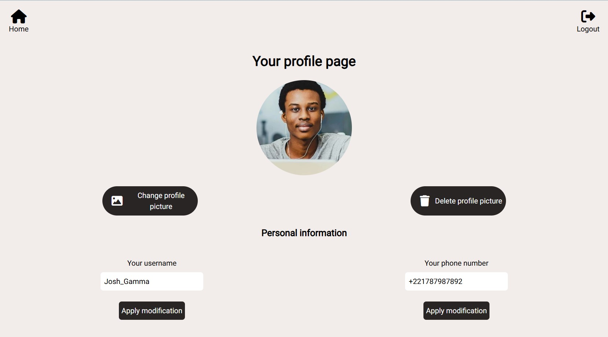
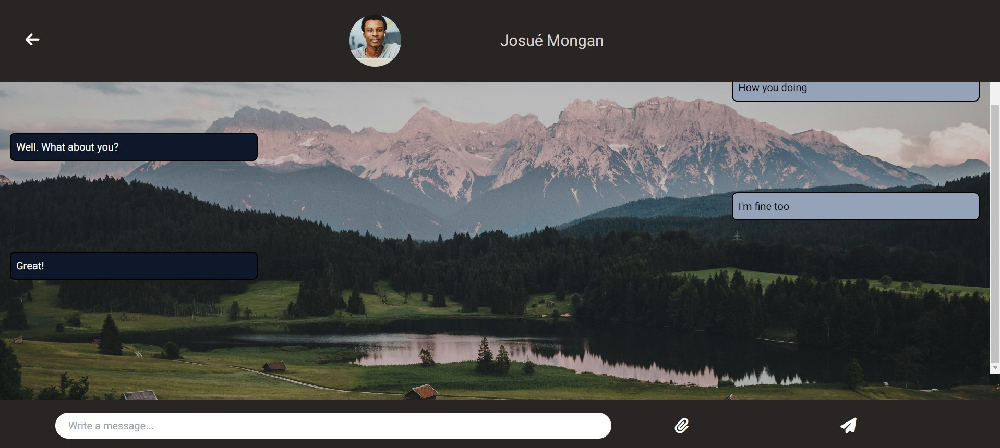
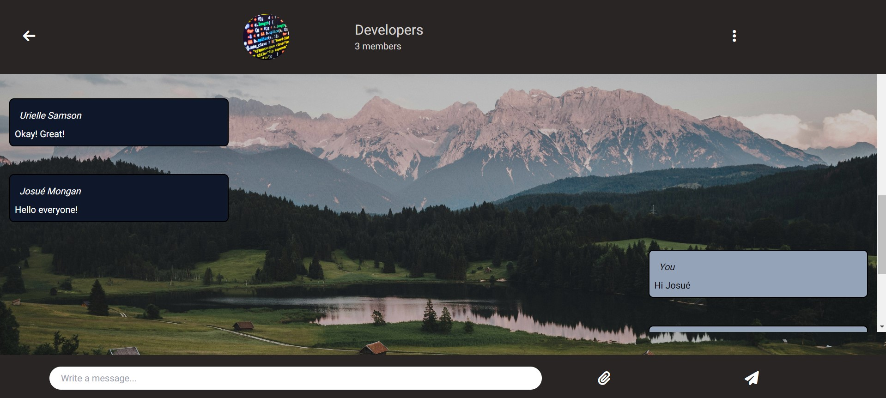

## Preview
 
 
 

## About the project
The project is a real-time chat app. It helped me explore websocket.

## How it works
The users have conversations and groups. They also have a profile to manage their information.

So how it works! Their are user, conversation, group and message models. The user can search a friend already on the app with its mail. Their conversation is then added and they can receive messages from each other using the websocket. The messages can be text, images or even videos. The messages are also saved so that the users can access the chat history.

Groups can also be created with more than 2 users if needed! It enable communication between much more users on the same subject.

## How to start
There are certain essentials steps you must follow after **cloning the project**, in other to be able to use the app properly.

First you need to **create a database**.

Secondly, you must **fill the .env file in the root directory** with the good environnement variables:
MONGO_URI=
NEXT_PUBLIC_API_URL=
JWT_SECRET=

Also **fill the .env file in the server file** with the good environnement variables:
MONGO_URI=

Thirdly, you run the app:
**npm i** in the root directory
**npm run dev** in the root directory
**cd server && npm i**
**cd server && npm start**
**cd server && npm run watch**

## Demo
You can see a demo of the app run locally on this linkedin post: https://www.linkedin.com/posts/josu%C3%A9-mongan-a7b6242b8_websocket-realtimechatapp-fullstack-activity-7232853217909370880-JCX1?utm_source=share&utm_medium=member_desktop

## Hope you enjoy
Have fun, leave a star if you like please and any contribution or improvement is welcome.